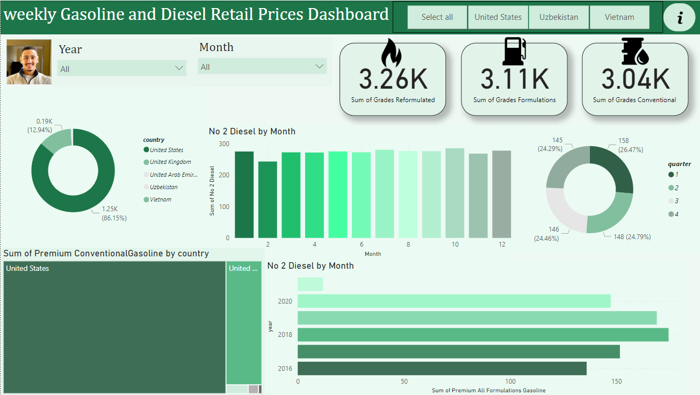
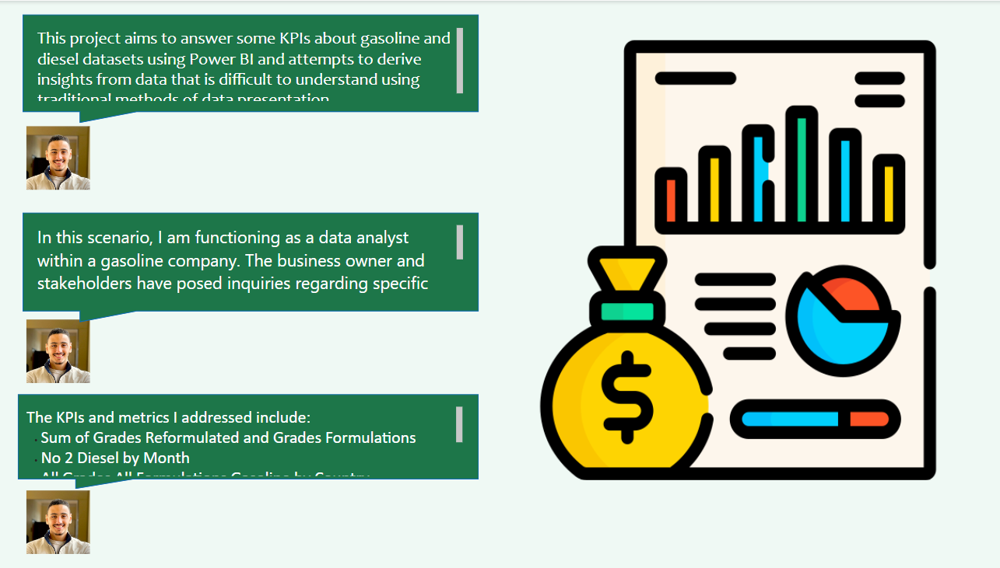
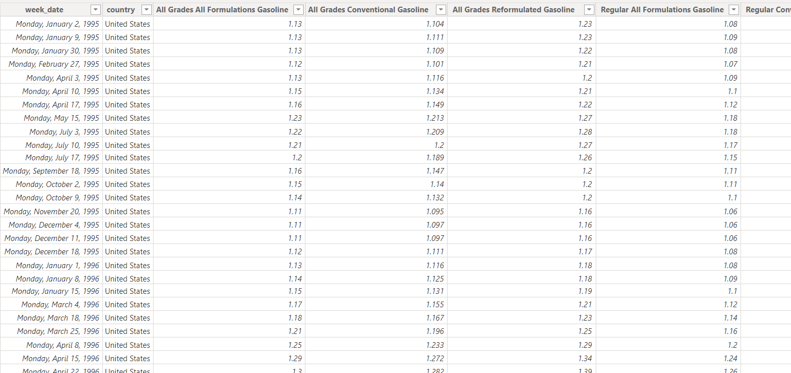

# Gasoline and desiel retail prices
Gasoline and desiel analysis using Power BI + Power Query

# Table of Contents

1.**Introduction**

1.**Overview Dashboard**

3.**Dataset**

4.**SQL**

5.**Usage**

6.**Contact Info**

# Intoduction
This project use Power Bi + SQL for answering the KPIs about the Gasoline and Desiel industry.

# Dashboard final rview

1. Overview page

2. Info page

**Process of the project**

This project centers around analyzing and visualizing retail prices of gasoline and diesel using SQL queries to extract and manipulate the data and Power BI to create interactive dashboards for stakeholders. The aim is to provide insights into pricing trends, regional variations, and other key performance indicators (KPIs) to assist stakeholders in making informed decisions.

# Dataset

# SQL
**SQl queries**
the sql queris contains a 11 type of KPIs :
1. All Grades All Formulations Gasoline By country
2. All Grades All Formulations Gasoline By country in June & July 1995
3. All Grades Conventional Gasoline By country in 2020 first quarter
4. AVG All Grades Reformulated Gasoline  By country
5. AVG Regular All Formulations Gasoline By year and country
6.  Total retail prices of Premium Conventional Gasoline by month
7.   No 2 Diesel AVG Retail Prices By years
8.   No 2 Diesel Retail Prices by each month in 2018 and 2019 

to view the SQL KPIs [Click Here](https://github.com/sahermuhamed1/Gasoline-and-desiel-retail-Prices/blob/main/GASOLINE%20AND%20DESIEL%20WEEKLY%20RETAIL%20PRICES%20SQL%20QUERIES.docx)

# Usage
to access the Dashboard [Click Here](https://github.com/sahermuhamed1/Gasoline-and-desiel-retail-Prices/blob/main/Gasoline%20and%20Diesel.pbix)

to access the SQL KPIs [Click Here](https://github.com/sahermuhamed1/Gasoline-and-desiel-retail-Prices/blob/main/GASOLINE%20AND%20DESIEL%20WEEKLY%20RETAIL%20PRICES%20SQL%20QUERIES.docx)

to access the Dataset [Click Here](https://github.com/sahermuhamed1/Gasoline-and-desiel-retail-Prices/blob/main/weekly%20Gasoline%20and%20Diesel%20Retail%20Prices.csv)

# Contact info
If you have any questions, encounter issues, or want to discuss anything related to this repository, please feel free to reach out to me. You can contact me via:

Email: @sahermuhamed176@gmail.com
LinkedIn: [Click Here](https://www.linkedin.com/in/sahermuhamed/)

I welcome any feedback, suggestions, or inquiries and will do my best to assist you promptly. Your insights and contributions are greatly appreciated!
